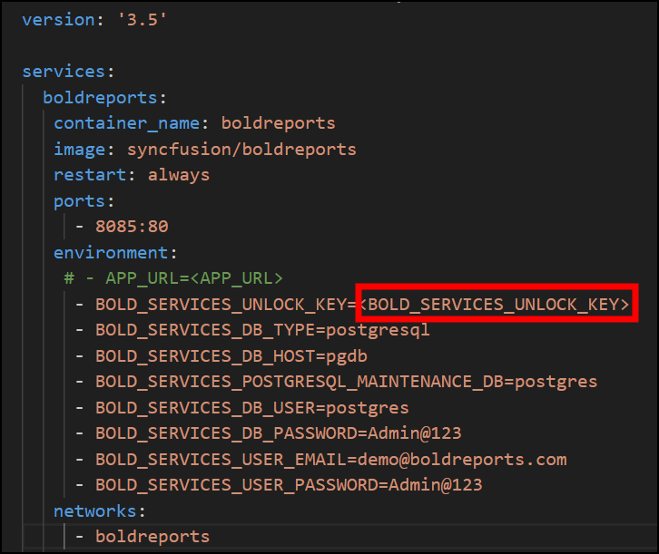

<a href="https://www.boldreports.com"></a>
<br/>
<br/>

[](https://github.com/boldreports/bold-reports-docker/releases)
[](https://help.boldreports.com/enterprise-reporting/)
[](https://www.boldreports.com/support)

# What is Bold Reports

Bold Reports Enterprise Reporting is a business intelligence report management tool, built by Syncfusion for creating, managing, and distributing pixel-perfect paginated RDL reports behind your organization’s firewall.

Enterprise Reporting help us to analyse, explain and report business information in our day-to-day life.

## Deployment Prerequisites

### Hardware requirements

The following hardware requirements are necessary to run the Bold Reports solution:

* Operating System: You can use the Bold Reports Docker and Podman on the following operating systems: 
  * Windows
  * Linux
  * Mac
* CPU: 4-core.
* Memory: 16 GB RAM.
* Disk Space: 8 GB or more.

### Software requirements

The following software requirements are necessary to run the Bold Reports Enterprise edition:

* Database: Microsoft SQL Server 2012+ | PostgreSQL | MySQL
* Application: Docker, Podman
* Web Browser: Microsoft Edge, Mozilla Firefox, and Chrome

# Supported tags

| Tags  | OS Version    | Last Modified(MM/DD/YYYY)| Purpose |
| ------------- | ------------- | ------------- | ------------- |
| `8.1.1-eval` | Debian 12  (amd64,arm64) | 02/22/2025 | This Docker image is specifically designed to streamline the Bold Reports evaluation process by integrating a PostgreSQL server within the Bold Reports container. Please note that this image tag is intended for evaluation purposes only and should not be used in production environments. |
| `8.1.1`, `latest` | Debian 12  (amd64,arm64)    | 02/22/2025 | This tag is intended for production use. Select this variant if you prefer Debian as the base image for your deployment. |
| `8.1.1-alpine`    | Alpine 3.13  (amd64, arm64)  | 02/22/2025 | This tag is intended for production use. Select this variant if you prefer Alpine as the base image for your deployment. |
| `8.1.1-focal`     | Ubuntu 22.04  (amd64, arm64)       | 02/22/2025 | This tag is intended for production use. Select this variant if you prefer Ubuntu as the base image for your deployment. |

# How to use this image

The above Bold Reports image can be deployed using Docker or Docker Compose. In the following section, we are going to start the Bold Reports application and a separate PostgreSQL instance with volume mounts for data persistence using Docker Compose.

  1. Download the Docker Compose file by using the following command.
  ```sh
  curl -o docker-compose.yml "https://raw.githubusercontent.com/boldreports/bold-reports-docker/master/deploy/single-container-eval/docker-compose.yaml"
  ```
  2. Fill the BOLD_SERVICES_UNLOCK_KEY value, and save it. You can refer to [this](https://support.boldreports.com/kb/article/13271/how-do-i-get-my-offline-license-key-from-our-bold-reports-account-page) KB document to obtain the offline Bold Reports unlock key. 

      
  
  3. Fill the Environment Variables and optional library by refer [this](docs/environment-variable.md). 
  
  4. Run the command below. This command will start the Bold Reports and Postgres SQL containers and display the Bold Reports logs to provide information about the installation status of the Bold Reports application.
     ```sh
     docker-compose up -d; docker-compose logs -f boldreports
     ```
     

  5. Now, access the Bold Reports application by entering the URL as `http://localhost:8090` or `http://host-ip:8090` in the browser. When opening this URL in the browser, it will configure the application startup in the background and display the page below within a few seconds. The default port number mentioned in the compose file is 8090. If you are making changes to the port number, then you need to use that port number for accessing the Bold Reports application.

     

      > **Note:** </br> 1. The deployment steps above are recommended for evaluation purposes only. For a production use case, you will need to mount the volume to the host path location or online storage and utilize managed DB servers. </br>2. Don't use localhost IP (`http://127.0.0.1`) with `port` to access the application.
# How to Deploy Bold Reports using Advanced Configuration?

In this section, you will learn how to run the Bold Reports application using advanced configurations such as configuring Bold Reports using an existing DB server, using a host directory as a persistent volume, configuring startup manually, configuring an SSL certificate, and running a multi-container Reports application.

1. [How to deploy Bold Reports using existing DB server?](./docs/how-to-deploy-bold-reports-using-existing-db-server.md)
2. [How to deploy Bold Reports and configure startup manually?](./docs/how-to-deploy-bold-reports-and-configure-startup-manually.md)
3. [How to use host path as Persistent Volume?](./docs/how-to-use-host-path-as-persistent-volume-for-bold-reports-deployment.md)
4. [How to configure SSL for Bold Reports application?  ](./docs/FAQ/how-to-configure-ssl-for-docker-compose.md)
5. [How to start multiple containers Bold Reports with Docker Compose?](./docs/multiple-container.md)
6. [How to start multiple containers podman Bold Reports with Docker Compose?](./docs/multiple-container-podman.md)
7. [Bold Reports supported environment variables and their usage?](./docs/environment-variable.md)

# License

https://www.boldreports.com/terms-of-use/on-premise<br />

The images are provided for your convenience and may contain other software that is licensed differently (Linux system, Bash, etc. from the base distribution, along with any direct or indirect dependencies of the Bold Reports platform).

These pre-built images are provided for your convenience and include all optional and additional libraries by default. These libraries may be subject to different licenses than the Bold Reports product.

If you want to install Bold Reports from scratch and precisely control which optional libraries are installed, please download the stand-alone product from boldreports.com. If you have any questions, please contact the Bold Reports team (https://www.boldreports.com/support).

It is the image user's responsibility to ensure that any use of this image complies with any relevant licenses for all software contained within.

# FAQ

[How to configure SSL for Bold Reports Application in single container and multiple container?](https://github.com/boldreports/bold-reports-docker/blob/master/docs/FAQ/how-to-configure-ssl-for-docker-compose.md)

[How to reset the database for Bold Reports application in docker environment?](./docs/FAQ/how-to-reset-the-database-in-docker.md)

[How to auto deploy multiple services Bold Reports via docker-compose?](./docs/FAQ/how-to-auto-deploy-bold-reports-multiple-services-in-docker-compose.md)

[How to upgrade a new image in docker environment using docker compose yaml file?](./docs/upgrade.md)

[How to deploy Bold Reports on an ECS Fargate cluster using an Application Load Balancer](https://support.boldreports.com/kb/article/14105/deploy-bold-reports-on-an-ecs-fargate-cluster-using-an-application-load-balancer)
