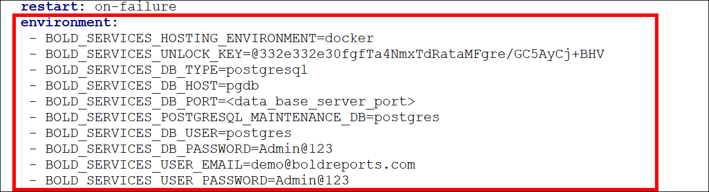

# How to auto deploy multiple services Bold Reports via docker-compose.
This section allows you to deploy [Bold Reports](https://www.boldreports.com/) in docker-compose without manual activation of licensing and configuring startup from the browser.

## Steps for Bold Reports multiple services auto deployment using docker-compose.
1. Create an empty project directory.
   You can name the directory something easy for you to remember. This directory is the context for your application image. This project directory should contains a `docker-compose.yml` file which is complete in itself for a good starter BoldReports project.

2. Download the configuration files [here](https://github.com/boldreports/bold-reports-docker/tree/master/deploy/multiple-container). This directory includes docker-compose YML file and configuration file for Nginx.
   > **Tip:** You can use either a `.yml` or `.yaml` extension for this file. They both works well.

3. Change into your project directory. For example, if you named your directory my_boldreports
   > $  cd my_boldreports/
4. Create a docker-compose.yml file that starts your `BoldReports` and a separate `PostgreSQL` instance with volume mounts for data persistence:

   ```sh

     version: '3.5'

     services:
       id-web:
         container_name: id_web_container
         image: us-docker.pkg.dev/boldreports/v6-2-32/bold-identity:6.2.32
         restart: on-failure
         environment:
           # Required
           - APP_BASE_URL=<app_base_url>                      # Set the Application base URL or the machine IP of external DNS to access the site. For example: https://example.com or http://172.174.25.9 or http://host.docker.internal
           # Optional: Uncomment the line below, if you want to use the client libraries.
           #  - INSTALL_OPTIONAL_LIBS=mysql,oracle,postgresql,snowflake
         volumes:
           - boldservices_data:/application/app_data
         networks:
           - boldservices
          healthcheck:
              test: ["CMD", "curl", "-f", "http://localhost/health-check"]
              interval: 10s
              timeout: 10s
              retries: 5

     id-api:
       container_name: id_api_container
       image: us-docker.pkg.dev/boldreports/v6-2-32/bold-identity-api:6.2.32
       restart: on-failure
       volumes: 
         - boldservices_data:/application/app_data
      networks:
        - boldservices
      depends_on:
        - id-web
      healthcheck:
          test: ["CMD", "curl", "-f", "http://localhost/health-check"]
          interval: 10s
          timeout: 10s
          retries: 5

   id-ums:
      container_name: id_ums_container
      image: us-docker.pkg.dev/boldreports/v6-2-32/bold-ums:6.2.32
      restart: on-failure
      environment:
         - BOLD_SERVICES_HOSTING_ENVIRONMENT=docker
       #  - BOLD_SERVICES_UNLOCK_KEY=<Bold_Reports_license_key>
       #  - BOLD_SERVICES_DB_TYPE=<data_base_server_type>
       #  - BOLD_SERVICES_DB_HOST=<data_base_server_host>
       #  - BOLD_SERVICES_DB_PORT=<data_base_server_port>
       #  - BOLD_SERVICES_POSTGRESQL_MAINTENANCE_DB=<maintenance_db_name>
       #  - BOLD_SERVICES_DB_USER=<data_base_user_name>
       #  - BOLD_SERVICES_DB_PASSWORD=<data_base_server_password>
       #  - BOLD_SERVICES_USER_EMAIL=<Bold_Reports_user_email>
       #  - BOLD_SERVICES_USER_PASSWORD=<Bold_Reports_user_password>
      volumes:
         - boldservices_data:/application/app_data
      networks:
         - boldservices
      depends_on:
         - id-web
      healthcheck:
         test: ["CMD", "curl", "-f", "http://localhost/health-check"]
         interval: 10s
         timeout: 10s
         retries: 5

   reports-web:
      container_name: reports_web_container
      image: us-docker.pkg.dev/boldreports/v6-2-32/boldreports-server:6.2.32
      restart: on-failure
      volumes: 
         - boldservices_data:/application/app_data
      networks:
         - boldservices
      depends_on:
         - id-web
      healthcheck:
         test: ["CMD", "curl", "-f", "http://localhost/health-check"]
         interval: 10s
         timeout: 10s
         retries: 5

   reports-api:
      container_name: reports_api_container
      image: us-docker.pkg.dev/boldreports/v6-2-32/boldreports-server-api:6.2.32
      restart: on-failure
      volumes: 
         - boldservices_data:/application/app_data
      networks:
         - boldservices
      depends_on:
         - id-web
         - reports-web
      healthcheck:
         test: ["CMD", "curl", "-f", "http://localhost/health-check"]
         interval: 10s
         timeout: 10s
         retries: 5

   reports-jobs:
      container_name: reports_jobs_container
      image: us-docker.pkg.dev/boldreports/v6-2-32/boldreports-server-jobs:6.2.32
      restart: on-failure
      volumes: 
         - boldservices_data:/application/app_data
      networks:
         - boldservices
      depends_on:
         - id-web
         - reports-web
      healthcheck:
         test: ["CMD", "curl", "-f", "http://localhost/health-check"]
         interval: 10s
         timeout: 10s
         retries: 5

   reports-viewer:
      container_name: reports_viewer_container
      image: us-docker.pkg.dev/boldreports/v6-2-32/boldreports-viewer:6.2.32
      restart: on-failure
      volumes: 
         - boldservices_data:/application/app_data
      networks:
         - boldservices
      depends_on:
         - id-web
         - reports-web
      healthcheck:
         test: ["CMD", "curl", "-f", "http://localhost/health-check"]
         interval: 10s
         timeout: 10s
         retries: 5

   reports-designerservice:
      container_name: reports_dataservice_container
      image: us-docker.pkg.dev/boldreports/v6-2-32/boldreports-designer:6.2.32
      restart: on-failure
      volumes:
         - boldservices_data:/application/app_data
      networks:
         - boldservices
      depends_on:
         - id-web
         - reports-web
      healthcheck:
         test: ["CMD", "curl", "-f", "http://localhost/health-check"]
         interval: 10s
         timeout: 10s
         retries: 5

   reports-etl:
      container_name: reports_etl_container
      image: us-docker.pkg.dev/boldreports/v6-2-32/bold-etl:6.2.32
      restart: on-failure
      volumes:
         - boldservices_data:/application/app_data
      networks:
         - boldservices
      depends_on:
         - id-web
         - reports-web
      healthcheck:
        test: ["CMD", "curl", "-f", "http://localhost/health-check"]
        interval: 10s
        timeout: 10s
        retries: 5

   reverse-proxy:
      container_name: nginx
      image: nginx
      restart: on-failure
      volumes:
         -   "<default_conf_path>:/etc/nginx/conf.d/default.conf"     # Set the default.conf file path.
         # Uncomment the lines below, if you want to configure the SSL.
         # - "<ssl_cert_file_path>:/etc/ssl/domain.crt"
         # - "<ssl_key_file_path>:/etc/ssl/domain.key"
      ports:
         - "80:80"
         # - "443:443"
      environment:
         - NGINX_PORT=80
      networks:
         - boldservices
      depends_on:
         - id-web
         - id-api
         - id-ums
         - reports-web
         - reports-api
         - reports-jobs
         - reports-designerservice
         - reports-etl
   pgdb:
      image: postgres
      restart: always
      environment:
         POSTGRES_PASSWORD: <Password>                  # Set the password for the PostgreSQL database that will be deployed along with this Bold Reports deployment.
      volumes:
         - db_data:/var/lib/postgresql/data/
      networks:
         - boldservices

   networks:
   boldservices:

   volumes:
   boldservices_data:
      driver: local
      driver_opts:
         type: 'none'
         o: 'bind'
         device: '<host_path_boldservices_data>'         # Set the path for storing the data of the bold reports.
   db_data:
      driver: local
      driver_opts:
         type: 'none'
         o: 'bind'
         device: '<host_path_db_data>'                   # Set the path for the docker PostgreSQL database data to be stored.
   ```      


5. Replace `<app_base_url>` with your DNS or IP address, by which you want to access the application.

   For example,<br />
   `http://example.com`<br />
   `https://example.com`<br />
   `http://<public_ip_address>`<br />
   `http://host.docker.internal`

   > **Note:**
   > * If you are using the IP address for the Base URL, make sure you are using the public IP of the machine instead of internal IP or local IP address. Applications can communicate with each other using the public IP alone. Host machine IP will not be accessible inside the application container.
   > * Use http://host.docker.internal instead of http://localhost. Host machine localhost DNS will not be accessible inside the container. So, docker desktop provides `host.docker.internal` and `gateway.docker.internal` DNS for communication between docker applications and host machine. Please make sure that the host.docker.internal DNS has your IPv4 address mapped in your hosts file on Windows(C:\Windows\System32\drivers\etc\hosts) or Linux (/etc/hosts).
   > * Provide the HTTP or HTTPS scheme for APP_BASE_URL value.

6. Uncommand and enter the variable information needed to complete the auto-deployment.

   ```sh
     environment:
       - BOLD_SERVICES_HOSTING_ENVIRONMENT=docker
      # - BOLD_SERVICES_UNLOCK_KEY=<Bold_Reports_license_key>
      # - BOLD_SERVICES_DB_TYPE=<data_base_server_type>
      # - BOLD_SERVICES_DB_HOST=<data_base_server_host>
      # - BOLD_SERVICES_DB_PORT=<data_base_server_port>
      # - BOLD_SERVICES_POSTGRESQL_MAINTENANCE_DB=<maintenance_db_name>
      # - BOLD_SERVICES_DB_USER=<data_base_user_name>
      # - BOLD_SERVICES_DB_PASSWORD=<data_base_server_password>
      # - BOLD_SERVICES_USER_EMAIL=<Bold_Reports_user_email>
      # - BOLD_SERVICES_USER_PASSWORD=<Bold_Reports_user_password>
   ```
## Environment variables details for configuring Application Startup in the backend.

| Name               | Required    | Description |
| -------------      | -------------       | ------------- |
|`BOLD_SERVICES_UNLOCK_KEY`                  | Yes      | License key for activating the Bold Reports. Please refer to [this document](https://support.boldreports.com/kb/article/13271/how-do-i-get-my-offline-license-key-from-our-bold-reports-account-page) to download the key.<br />If you don't have the download key option, please create a support ticket [here](https://support.boldreports.com/support/tickets/create).|
|`BOLD_SERVICES_DB_TYPE`                     | Yes      | Type of database server can be used for configuring the Bold Reports.<br /><br />The following DB types are accepted:<br />1. mssql – Microsoft SQL Server/Azure SQL Database<br />2. postgresql – PostgreSQL Server<br />3. mysql – MySQL/MariaDB Server|
|`BOLD_SERVICES_DB_HOST`                     | Yes      | Name of the Database Server|
|`BOLD_SERVICES_DB_PORT`                     | No       | The system will use the following default port numbers based on the database server type.<br />PostgrSQL – 5234<br />MySQL -3306<br /><br />Please specify the port number for your database server if it is configured on a different port.<br /><br />For MS SQL Server, this parameter is not necessary.|
|`BOLD_SERVICES_DB_USER`                     | Yes       | Username for the database server<br /><br />Please refer to [this documentation](https://help.boldreports.com/enterprise-reporting/administrator-guide/faq/what-are-the-database-permissions-required-to-set-up-bold-reports/) for information on the user's permissions.|
|`BOLD_SERVICES_DB_PASSWORD`                 | Yes       | The database user's password|
|`BOLD_SERVICES_DB_NAME`                     | No        | If the database name is not specified, the system will create a new database called bold services.<br /><br />If you specify a database name, it should already exist on the server.|
|`BOLD_SERVICES_POSTGRESQL_MAINTENANCE_DB`   | Yes       | For PostgreSQL DB Servers, this is an optional parameter.<br />The system will use the database name `postgres` by default.<br />If your database server uses a different default database, please provide it here.|
|`BOLD_SERVICES_DB_ADDITIONAL_PARAMETERS`    | No        | If your database server requires additional connection string parameters, include them here.<br /><br />Connection string parameters can be found in the official document.<br />My SQL: https://dev.mysql.com/doc/connector-net/en/connector-net-8-0-connection-options.html<br />PostgreSQL: https://www.npgsql.org/doc/connection-string-parameters.html<br />MS SQL: https://docs.microsoft.com/en-us/dotnet/api/system.data.sqlclient.sqlconnection.connectionstring<br /><br /><b>Note:</b> A semicolon(;) should be used to separate multiple parameters.|
|`BOLD_SERVICES_USER_EMAIL`                   | Yes       | It should be a valid email.|
|`BOLD_SERVICES_USER_PASSWORD`                | Yes       | It should meet our password requirements.<br /><br /><b>Note:</b>Password must meet the following requirements. It must contain,At least 6 characters, 1 uppercase character, 1 lowercase character, 1 numeric character, 1 special character|

Example:



7. You can also change the Port number other than `80`

8. Provide the **default.conf** file path, which you have downloaded earlier in `<default_conf_path>` place.

   For example,<br />
   `"./default.conf:/etc/nginx/conf.d/default.conf"`<br />
   `"D:/boldreports/docker/default.conf":"/etc/nginx/conf.d/default.conf"`<br />
   `"/var/boldreports/docker/default.conf:/etc/nginx/conf.d/default.conf"`

   

9. Allocate a directory in your host machine to store the shared folders for applications’ usage. Replace the directory path with `<host_path_boldservices_data>` and `<host_path_db_data>` in **docker-compose.yml** file.

For example,

**Windows:** `device: 'D:/boldreports/boldservices_data'` and `device: 'D:/boldreports/db_data'`<br />
**Linux:** `device: '/var/boldreports/boldservices_data'` and `device: '/var/boldreports/db_data'`
   > **Note:** The docker volumes boldservices_data and db_data persists data of Bold Reports and PostgreSQL respectively. [Learn more about docker volumes](https://docs.docker.com/storage/volumes/)

## Build the project

Now, run `docker-compose up -d` from your project directory.
This runs `docker-compose up` in detached mode, pulls the needed Docker images, and starts the boldreports and database containers, as shown in the example below.

## Bring up BoldReports in a web browser

At this point, BoldReports should be running in <app_base_url> (as appropriate)
   > **Note:** The BoldReports site is not immediately available on port 80 because the containers are still being initialized and may take a couple of minutes before the first load.

## Application Startup
Configure the Bold Reports On-Premise application startup to use the application. Please refer the following link for more details on configuring the application startup.

https://help.boldreports.com/enterprise-reporting/administrator-guide/application-startup/

   > **Note:** To use the above configured PostgreSQL server in Bold Reports please use `pgdb` as the PostgreSQL server name.

## Shutdown and cleanup
The command `docker-compose down` removes the containers and default network, but preserves the volumes of Bold Reports and PostgreSQL.

The command `docker-compose down --volumes` removes the containers, default network, and all the volumes.


