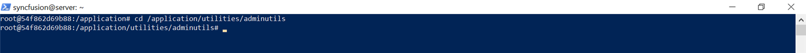
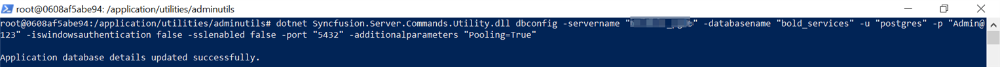

# How to reset the database for Bold Reports application in docker environment.

This section explain how to reset the application database of Bold Reports server application through the command line interface.

* [Single image deployment](#single-container-deployment)

## Single container deployment

1. Open the command prompt and Bash the container then change the directory to the admin utility location.
   ```sh
   docker exec -it <Container ID or Container name>
   ``` 

   ```sh
   cd /application/utilities/adminutils/
   ``` 

   

2. After changing the directory, run the following command to reset the database.

   ```sh
   dotnet Syncfusion.Server.Commands.Utility.dll dbconfig -servername "localhost" -databasename "BoldReportsMasterDatabase" -u "Admin" -p "Admin@12345" -iswindowsauthentication false -sslenabled false -port "5432" -additionalparameters "Pooling=True"   
   ``` 

   

3. Once, the database has been updated successfully, then restart the application by using below command

   ```sh
   docker restart <container ID or container name>
   ``` 

