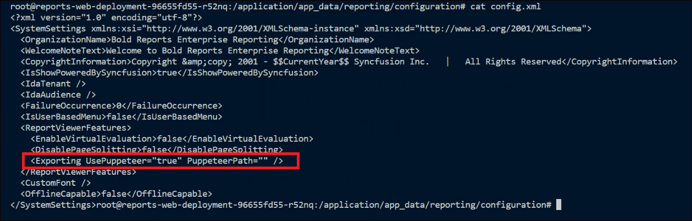

# Enable Puppeteer when upgrading lower version to 5.4.20

> **Important:** Puppeteer are necessary to achieve `image and PDF export` functionalities in reports,schedules from Bold Reports. Without these packages, the image and PDF export options in reports and schedules will no longer be available.

1. Navigate to the following directory in the persistent volume.

     ```sh
    cd /<host_path_for_appdata_files>/reporting/configuration
    ```
	Example: root@multidockervm:/home/devops/bold-reportsvolume/reporting/configuration

2. Edit the config.xml file by using below command.

    ```sh
    nano config.xml
    ```

3. Add the following line on the config file to enable the puppeteer and save the changes.

    ```sh
    <Exporting UsePuppeteer="true" PuppeteerPath=""></Exporting>
    ```
    


4. Restart the report container based on your Docker setup using given commands,

    Mulitple-Container:

    ```sh
    docker restart reports_web_container reports_api_container reports_jobs_container reports_reportservice_container reports_viewer_container
    ```

    Singlecontainer:

    ```sh
    docker restart <container name>
    ``````

    Example: docker restart boldreports