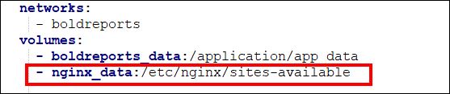

# How to configure SSL for Bold Reports application?

* [Single container deployment](#single-container-deployment)
* [Multi container deployment](#multi-container-deployment)

## Single container deployment

1. From the docker-compose yaml file add below line under volume in the `boldreports` service.
   ```sh
   - nginx_data:/etc/nginx/sites-available
   ```
   

2. Add below block for `nginx` in volume and allocate a directory in your host machine to store the shared folders for applications usage. Replace the directory path with `<host_path_nginx_data>` in docker-compose.yml file and up a container.
   ```sh
     nginx_data:
       driver: local
       driver_opts:
         type: 'none'
         o: 'bind'
         device: '<host_path_nginx_data>'
   ```

   For example,
   **Windows:** `device: 'D:/boldreports/nginx_data'` and `device: 'D:/boldreports/nginx_data'`
   **Linux:** `device: '/var/boldreports/nginx_data'` and `device: '/var/boldreports/nginx_data'`

3. Copy the SSL certificate `.key` and `.crt` format and paste inside the `nginx` mount folder.
4. Refer below document for SSL changes in `nginx` file .
   [https://github.com/boldreports/bold-reports-docker/blob/main/docs/ssl-termination.md](../docs/ssl-termination.md)
5. Restart the Bold Reports container using below command.
   ```sh
   docker restart <container-name or container ID>
   ```

## Multi container deployment

1. Add a SSL certificate path with `.key` and `.crt` file in docker-compose yaml file.
   

2. Refer below document for SSL changes in nginx file .
   [https://github.com/boldreports/bold-reports-docker/blob/main/docs/ssl-termination.md](../docs/ssl-termination.md)

3. Restart the Nginx container using below command.
   ```sh
   docker restart <container-name or container ID>
   ```