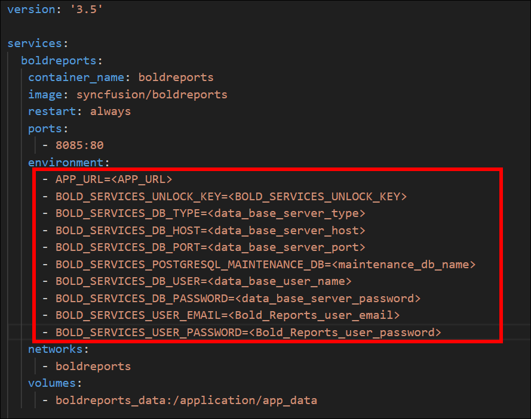

# How to deploy Bold Reports using existing DB server?

In the following section, we are going to run the Bold Reports application by passing the application startup backend configuration environment variable using the existing DB server details.

1. Download docker compose file using the following command.
   ```sh
   curl -o docker-compose.yml "https://raw.githubusercontent.com/boldbi/boldbi-docker/main/deploy/single-container-with-env-variable/docker-compose.yml"
   ```
2. Open the docker compose file and fill the mandatory fields - **APP_BASE_URL, Unlock Key** and **Database details**
   

   APP_BASE_URL Guidance:

   Provide the HTTP scheme for APP_BASE_URL value. For example,
   * Provide the HTTP scheme for APP_BASE_URL value. For example,
      `http://example.com`
      `http://<public_ip_address>`
   * For `Windows` and `MacOS` use either http://host.docker.internal or http://localhost. Docker Desktop provides host.docker.internal and gateway.docker.internal DNS for communication between docker applications and host machine. Please make sure that the host.docker.internal DNS has your IPv4 address mapped in your hosts file on Windows(C:\Windows\System32\drivers\etc\hosts).


