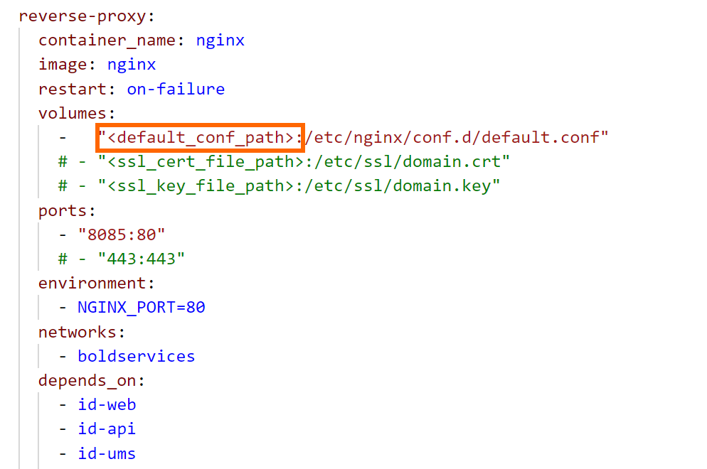

## Run multiple services `Bold Reports` via `docker-compose`

This quick-start guide demonstrates how to use Compose to set up and run Bold Reports. Before starting, make sure you have [Compose installed](https://docs.docker.com/compose/install/)

### Define the Project

  1. Create an empty project directory.<br/>
  You can name the directory something easy for you to remember. This directory is the context for your application image. This project directory should contains a `docker-compose.yml` file which is complete in itself for a good starter BoldReports project.

  2. Download the configuration files [here](/deploy/multiple-container/). This directory includes docker-compose YML file and configuration file for Nginx.
  
      > **Tip:**
        You can use either a `.yml` or `.yaml` extension for this file. They both works well.
  
  3.  Change into your project directory.
  For example, if you named your directory `my_boldreports`

      ```sh
      $  cd my_boldreports/
      ```

  4. Create a docker-compose.yml file that starts your `BoldReports`  and a separate `PostgreSQL` instance with volume mounts for data persistence:

     ```sh
      services:
        id-web:
          container_name: id_web_container
          image: us-docker.pkg.dev/boldreports/v11-1-10/bold-identity:11.1.10
          restart: on-failure
          environment:
            # Required
            - APP_BASE_URL=<app_base_url>                      # Set the Application base URL or the machine IP of external DNS to access the site. For example: https://example.com or http://172.174.25.9 or http://host.docker.internal
            # Optional: Uncomment the line below, if you want to use the client libraries.
            #  - INSTALL_OPTIONAL_LIBS=mysql,oracle,postgresql,snowflake,googlebigquery,mongodb
            - DEPLOY_MODE=docker_multi_container
          volumes:
            - boldservices_data:/application/app_data
          networks:
            - boldservices
          healthcheck:
              test: ["CMD", "curl", "-f", "http://localhost/health-check"]
              interval: 10s
              timeout: 10s
              retries: 5

        id-api:
          container_name: id_api_container
          image: us-docker.pkg.dev/boldreports/v11-1-10/bold-idp-api:11.1.10
          restart: on-failure
          volumes:
            - boldservices_data:/application/app_data
          networks:
            - boldservices
          depends_on:
            id-web:
              condition: service_healthy
          healthcheck:
              test: ["CMD", "curl", "-f", "http://localhost/health-check"]
              interval: 10s
              timeout: 10s
              retries: 5

        id-ums:
          container_name: id_ums_container
          image: us-docker.pkg.dev/boldreports/v11-1-10/bold-ums:11.1.10
          restart: on-failure
          volumes:
            - boldservices_data:/application/app_data
          networks:
            - boldservices
          depends_on:
            id-web:
              condition: service_healthy
          healthcheck:
              test: ["CMD", "curl", "-f", "http://localhost/health-check"]
              interval: 10s
              timeout: 10s
              retries: 5

        reports-web:
          container_name: reports_web_container
          image: us-docker.pkg.dev/boldreports/v11-1-10/boldreports-server:11.1.10
          restart: on-failure
          volumes:
            - boldservices_data:/application/app_data
          networks:
            - boldservices
          depends_on:
            id-web:
              condition: service_healthy
          healthcheck:
              test: ["CMD", "curl", "-f", "http://localhost/health-check"]
              interval: 10s
              timeout: 10s
              retries: 5

        reports-api:
          container_name: reports_api_container
          image: us-docker.pkg.dev/boldreports/v11-1-10/boldreports-server-api:11.1.10
          restart: on-failure
          volumes:
            - boldservices_data:/application/app_data
          networks:
            - boldservices
          depends_on:
            id-web:
              condition: service_healthy
            reports-web:
              condition: service_started
          healthcheck:
              test: ["CMD", "curl", "-f", "http://localhost/health-check"]
              interval: 10s
              timeout: 10s
              retries: 5

        reports-jobs:
          container_name: reports_jobs_container
          image: us-docker.pkg.dev/boldreports/v11-1-10/boldreports-server-jobs:11.1.10
          restart: on-failure
          volumes:
            - boldservices_data:/application/app_data
          networks:
            - boldservices
          depends_on:
            id-web:
              condition: service_healthy
            reports-web:
              condition: service_started
            reports-api:
              condition: service_started
          healthcheck:
              test: ["CMD", "curl", "-f", "http://localhost/health-check"]
              interval: 10s
              timeout: 10s
              retries: 5

        reports-reportservice:
          container_name: reports_reportservice_container
          image: us-docker.pkg.dev/boldreports/v11-1-10/boldreports-designer:11.1.10
          restart: on-failure
          volumes:
            - boldservices_data:/application/app_data
          networks:
            - boldservices
          depends_on:
            id-web:
              condition: service_healthy
            reports-web:
              condition: service_started
            reports-api:
              condition: service_started
          healthcheck:
              test: ["CMD", "curl", "-f", "http://localhost/health-check"]
              interval: 10s
              timeout: 10s
              retries: 5

        reports-viewer:
          container_name: reports_viewer_container
          image: us-docker.pkg.dev/boldreports/v11-1-10/boldreports-viewer:11.1.10
          restart: on-failure
          volumes:
            - boldservices_data:/application/app_data
          networks:
            - boldservices
          depends_on:
            id-web:
              condition: service_healthy
            reports-web:
              condition: service_started
          healthcheck:
              test: ["CMD", "curl", "-f", "http://localhost/health-check"]
              interval: 10s
              timeout: 10s
              retries: 5

        reports-etl:
          container_name: reports_etl_container
          image: us-docker.pkg.dev/boldreports/v11-1-10/bold-etl:11.1.10
          restart: on-failure
          volumes:
            - boldservices_data:/application/app_data
          networks:
            - boldservices
          depends_on:
            id-web:
              condition: service_healthy
            reports-web:
              condition: service_started
          healthcheck:
              test: ["CMD", "curl", "-f", "http://localhost/health-check"]
              interval: 10s
              timeout: 10s
              retries: 5

        reverse-proxy:
          container_name: nginx
          image: nginx
          restart: on-failure
          volumes:
            -   "<default_conf_path>:/etc/nginx/conf.d/default.conf"          # Set the default.conf file path.
            # Uncomment the lines below, if you want to configure the SSL.
            # - "<ssl_cert_file_path>:/etc/ssl/domain.crt"
            # - "<ssl_key_file_path>:/etc/ssl/domain.key"
          ports:
            - "80:80"
            # - "443:443"
          environment:
            - NGINX_PORT=80
          networks:
            - boldservices
          depends_on:
            id-web:
              condition: service_healthy
            id-api:
              condition: service_started
            id-ums:
              condition: service_started
            reports-web:
              condition: service_started
            reports-api:
              condition: service_started
            reports-jobs:
              condition: service_started
            reports-reportservice:
              condition: service_started
            reports-viewer:
              condition: service_started
            reports-etl:
              condition: service_started
        pgdb:
          image: postgres
          restart: always
          environment:
            POSTGRES_PASSWORD: <Password>              # Set the password for the PostgreSQL database that will be deployed along with this Bold Reports deployment.
          volumes:
            - db_data:/var/lib/postgresql/data/
          networks:
            - boldservices

      networks:
        boldservices:

      volumes:
        boldservices_data:
          driver: local
          driver_opts:
            type: 'none'
            o: 'bind'
            device: '<host_path_boldservices_data>'     # Set the path for storing the data of the bold reports.
        db_data:
          driver: local
          driver_opts:
            type: 'none'
            o: 'bind'
            device: '<host_path_db_data>'               # Set the path for the docker PostgreSQL database data to be stored.
     ```
  
  5. Replace `<app_base_url>` with your DNS or IP address, by which you want to access the application.
    
      For example, <br/>
          `http://example.com` <br/>
          `https://example.com` <br/>
          `http://<public_ip_address>` <br/>
          `http://host.docker.internal` <br/>

      > **Note:**
      > * If you are using the IP address for the Base URL, make sure you are using the public IP of the machine instead of internal IP or local IP address. Applications can communicate with each other using the public IP alone. Host machine IP will not be accessible inside the application container.
      > * Use http://host.docker.internal instead of http://localhost. Host machine localhost DNS will not be accessible inside the container. So, docker desktop provides `host.docker.internal` and `gateway.docker.internal` DNS for communication between docker applications and host machine. Please make sure that the host.docker.internal DNS has your IPv4 address mapped in your hosts file on Windows(C:\Windows\System32\drivers\etc\hosts) or Linux (/etc/hosts).
      > * Provide the HTTP or HTTPS scheme for APP_BASE_URL value.

  6. You can also change the Port number other than `80`

  7. Provide the **default.conf** file path, which you have downloaded earlier in `<default_conf_path>` place.

       For example, <br>`"./default.conf:/etc/nginx/conf.d/default.conf"`<br>
        `"D:/boldreports/docker/default.conf":"/etc/nginx/conf.d/default.conf"`<br>
        `"/var/boldreports/docker/default.conf:/etc/nginx/conf.d/default.conf"`

     

  8. Allocate a directory in your host machine to store the shared folders for applications’ usage. Replace the directory path with `<host_path_boldservices_data>` and `<host_path_db_data>` in **docker-compose.yml** file.

       For example, <br><b>Windows:</b> `device: 'D:/boldreports/boldservices_data'` and `device: 'D:/boldreports/db_data'` <br><b>Linux:</b> `device: '/var/boldreports/boldservices_data'` and `device: '/var/boldreports/db_data'`

      > **Note:**
      > The docker volumes `boldservices_data` and `db_data` persists data of Bold Reports and PostgreSQL respectively. [Learn more about docker volumes](https://docs.docker.com/storage/volumes/)

### Build the project

Now, run `docker-compose up -d` from your project directory.
<br />

This runs `docker-compose up` in detached mode, pulls the needed Docker images, and starts the boldreports and database containers, as shown in the example below.

### Bring up BoldReports in a web browser

At this point, BoldReports should be running in `<app_base_url>` (as appropriate)

> **Note:**
> The BoldReports site is not immediately available on port 80 because the containers are still being initialized and may take a couple of minutes before the first load.

### Application Startup

Configure the Bold Reports On-Premise application startup to use the application. Please refer the following link for more details on configuring the application startup.

https://help.boldreports.com/enterprise-reporting/administrator-guide/application-startup/

> **Note:**
> To use the above configured PostgreSQL server in Bold Reports please use `pgdb` as the PostgreSQL server name.

### Shutdown and cleanup

The command `docker-compose down` removes the containers and default network, but preserves the volumes of Bold Reports and PostgreSQL. <br /><br />
The command `docker-compose down --volumes` removes the containers, default network, and all the volumes.

