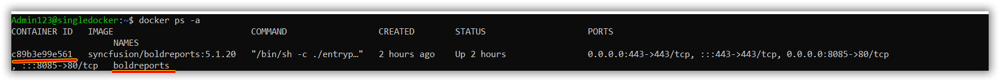

# Upgrading Bold Reports to latest version

This section explains how to upgrade Bold Reports to latest version in your Docker. You can refer to the features and enhancements from this [Release Notes](https://www.boldreports.com/release-history/embedded-reporting).


## Backup the existing data
Before upgrading the Bold Reports to latest version, make sure to take the backup of the following items.

* Files and folders from the shared location, which you have mounted to the deployments by volume.

* Database backup - Take a backup of Database, to restore incase if the upgrade was not successful or if applications are not working properly after the upgrade.


## Proceeding with upgrade for single container
Bold Reports updates the database schema of your current version to the latest version. The upgrade process will retain all the resources and settings from the previous deployment.

 1. If you are using the docker compose yaml file for deployment,
 You can download the latest docker-compose file from this [docker-compose](https://raw.githubusercontent.com/boldreports/bold-reports-docker/v5.2.26/deploy/single-container/docker-compose.yml) and use the below command to down the containers from where you deploy the docker compose file.

    ```sh
     docker-compose down
    ```
    Copy the latest downloaded files and replace in the exisitng deployed folder then give the values in required fields which is already done for existing Bold Reports Application. 

    And run the below command  to upgrade Bold Reports.

    ```sh
     docker-compose up -d
    ```
 2. Else, You are using the command to deploy Bold Reports in single container, Please follow the below steps for upgrade and use the below command to get all the containers,

    ```sh
     docker ps -a
    ```
    

    
    Now we need to remove the container without deleting the persistant volume which is already mounted with this container
    You can use the below command to remove the container.
    
    ```sh
    docker rm --force <containername>
    ```

    Example: docker rm --force boldreports

    Now we need to create a container with same container name and persisatnt volume path.

    ```sh 
    docker run --name boldreports -p 80:80 -p 443:443 \
     -e APP_URL=<app_base_url> \
     -e OPTIONAL_LIBS=<optional_library_names> \
     -v <existing_host_path_for_appdata_files>:/application/app_data \
     -v <existing_host_path_for_nginx_config>:/etc/nginx/sites-available \
     -d syncfusion/boldreports:<tag> 
    ```

    Example: docker run --name boldreports -p 8085:80 -p 443:443 -e APP_URL="http://20.163.205.44:8085" -e OPTIONAL_LIBS="mysql,oracle,postgresql" -v "/home/Admin123/upgrade/app_data":/application/app_data -v "/home/Admin123/upgrade/nginx":/etc/nginx/sites-available -d syncfusion/boldreports:5.1.20

    > **Note:**
    > When upgrading Bold Reports, ensure that the volume mount remains the same, and only the tag needs to be changed.
    > Once you run the container, please wait a couple of minutes to access the url. 


## Proceeding with upgrade for multiple container
Bold Reports updates the database schema of your current version to the latest version. The upgrade process will retain all the resources and settings from the previous deployment.

You can download the latest docker-compose file and default.conf from this [docker-compose](https://raw.githubusercontent.com/boldreports/bold-reports-docker/v5.2.26/deploy/multiple-container/docker-compose.yml)
[default.conf](https://raw.githubusercontent.com/boldreports/bold-reports-docker/v5.2.26/deploy/multiple-container/default.conf) and use the below command to down the containers from where you deploy the docker compose file.

```sh
docker-compose down
```

Copy the latest downloaded files and replace in the exisitng deployed folder then give the values in required fields which is already done for existing Bold Reports Application.

And run the below command to upgrade Bold Reports.

```sh
docker-compose up -d
```